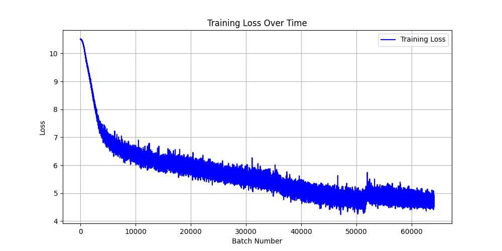
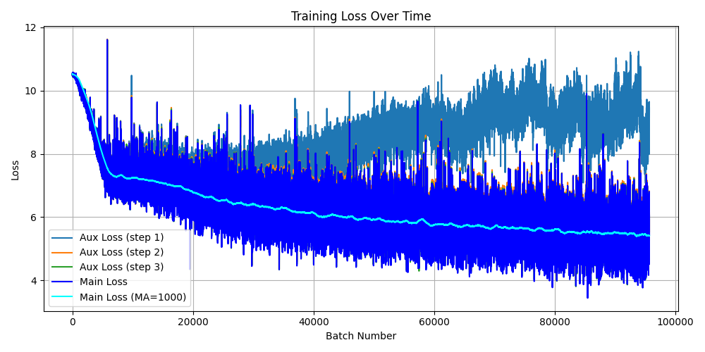
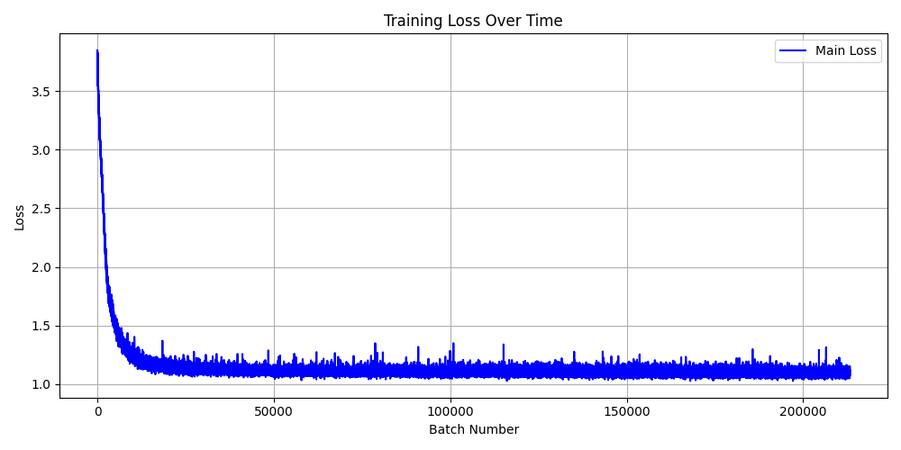
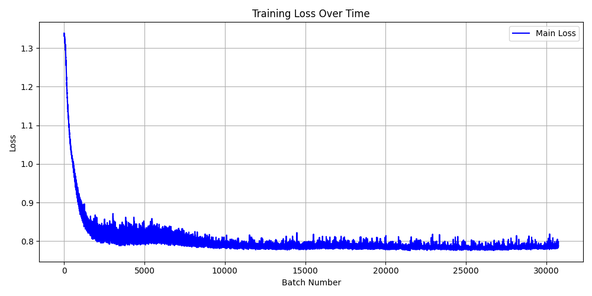

# MicroLM

Small language-model playground with three training styles in one codebase:

- Standard decoder-only transformer (`models/base.py`)
- Recursive interleaved refiner (`models/recursive.py`)
- Diffusion-style token refiner (`models/diffusion.py`)

If you want to tweak architecture, loss weights, or training scale without touching script logic, you mostly do it in `./configs`.

## What is in this repo

- `train.py`: trains either base decoder or recursive model (depends on `model_type` in config)
- `test.py`: interactive generation for base or recursive checkpoints
- `train_diffusion_refiner.py`: diffusion model train/test entrypoint
- `compare_models.py`: quick eval pass to compare configs/checkpoints
- `plot_losses.py`: plots `losses.pkl` to `training_loss_plot.png`
- `models/`: model implementations
- `configs/`: experiment presets
- `checkpoints/`: saved model weights

## Setup

This project assumes Python + PyTorch.

```powershell
python -m venv .venv
.\.venv\Scripts\activate
pip install torch transformers datasets tqdm matplotlib pydantic
```

Optional:

- `flash-attn` if you plan to enable `use_flash_attn` in configs.

## Configs

Configs are loaded from `./configs/<name>.json` using `--cfg <name>`.

Current presets:

- `microlm`, `microlmtest`: base decoder runs
- `refiner-7m`, `refiner-15m`: recursive runs
- `diffuser`, `diffuserlarge`: diffusion runs

Notes:

- Tokenizer defaults to `bert-base-uncased`.
- Dataset defaults to `BEE-spoke-data/fineweb-1M_longish`.
- Epoch length is controlled by `estimated_tokens_per_epoch` (streaming dataset), not strict dataset length.

## Train

Base decoder:

```powershell
python train.py --cfg microlm
```

Recursive model:

```powershell
python train.py --cfg refiner-7m
```

Diffusion model:

```powershell
python train_diffusion_refiner.py --cfg diffuser --mode train
```

Each run writes checkpoints using `checkpoint_prefix` from the config and logs losses to `losses.pkl`.

## Inference

Base or recursive:

```powershell
python test.py --cfg refiner-7m --checkpoint .\checkpoints\refiner-7m-epoch-1-batch-100.pt
```

Diffusion:

```powershell
python train_diffusion_refiner.py --cfg diffuser --mode test --checkpoint .\checkpoints\diffuser-7m-diffusion-final.pt
```

Both launch an interactive prompt loop in the terminal.

## Compare models

```powershell
python compare_models.py --cfgs microlm,refiner-7m,diffuser --max-batches 50
```

By default, each config uses its own `resume_checkpoint_path`.

If you want to override checkpoints manually, pass a comma-separated list in the same order as `--cfgs`.

## Plot losses

```powershell
python plot_losses.py --losses_file losses.pkl --moving_average 100
```

This writes `training_loss_plot.png`.

## Training curves

### Base MicroLM



### Recursive model



### Diffusion refiner (small)



### Diffusion refiner (large)


